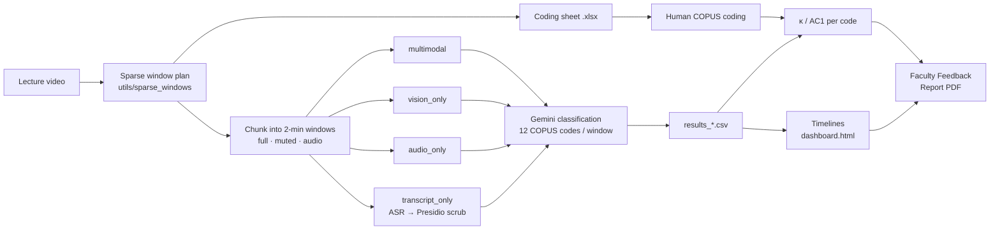

# AI-COPUS: Automated Classroom Observation for STEM Lectures

**Bridging the Feedback Gap: Enhancing STEM Instruction through AI-Driven Classroom Analytics**

AI-COPUS automates the [COPUS](https://www.lifescied.org/doi/10.1187/cbe.13-08-0154)
classroom observation protocol (Smith et al., 2013). It splits a lecture recording into
2-minute windows, has Google Gemini code each window for the 12 COPUS instructor
behaviours, measures agreement with a trained human observer (Cohen's κ and Gwet's AC1),
and turns the result into a behavioural timeline and a Faculty Feedback Report PDF for
the instructor.

It also runs a **modality ablation study**: the same prompt and model are given the
video with audio, the silent video, the audio alone, or a PII-scrubbed transcript, to
measure which input each COPUS code actually depends on.

## Features

- **Streamlit app** for the whole workflow: point it at a lecture, download the coding
  sheet it generates, upload your coding, run, and download the report. No terminal
  needed beyond starting it.
- **Sparse window sampling.** Long lectures are sampled in fixed 16-minute blocks, and
  the AI and the human coder are aligned on the same windows by construction.
- **Four-arm ablation**: multimodal, vision-only, audio-only and transcript-only, all with
  one shared prompt, the same windows and the same model.
- **Parallel execution.** Lectures, arms and windows run concurrently, with a single cap
  on in-flight API calls.
- **Reliability statistics**: per-code prevalence, % agreement, Cohen's κ and Gwet's AC1.
  Undefined κ is reported as `N/A`, not as 0.
- **Reproducible**: decoding is pinned (temperature 0 and a fixed seed), every result
  records the model that produced it, and reruns reuse cached results instead of calling
  the API again.
- **Privacy by design.** PII scrubbing runs locally with Microsoft Presidio, and no raw
  audio or video ends up in exports.

## How it works



## Quickstart

**Requirements:** Python 3.9+, [uv](https://docs.astral.sh/uv/), `ffmpeg` on your
`PATH`, and a Google Cloud project with Vertex AI enabled.

```bash
# 1. Install dependencies and the spaCy model Presidio uses
uv sync
uv run python -m spacy download en_core_web_lg

# 2. Configure credentials
cp .env.example .env        # then fill in project, region and key path

# 3. Launch the app
uv run streamlit run app.py
```

`.env` needs three variables:

```
GOOGLE_APPLICATION_CREDENTIALS=./gcp-key.json
GOOGLE_CLOUD_PROJECT=<your-gcp-project>
GOOGLE_CLOUD_LOCATION=<vertex-region, e.g. us-central1>
```

Install `ffmpeg` with `brew install ffmpeg` on macOS or `apt install ffmpeg` on Debian or
Ubuntu.

## Using the Streamlit app

```bash
uv run streamlit run app.py
```

1. **Lectures (up to 3).** Paste the path to each video and press Enter; for multi-GB
   recordings this is better than uploading. The app reads the duration, picks the
   sampling scheme, shows which blocks to watch, and pre-fills the window list.
2. **Download the coding sheet** for each lecture. It holds exactly the sampled windows,
   each row already labelled with its minute range. Code every row.
3. **Upload the filled sheets**, plus the professor's CUCEI workbook (optional). Its
   scores go into the Faculty Feedback Report.
4. In the sidebar, pick the **arm** (`all` runs the 4-arm ablation), the **model**, and
   **Parallel requests**.
5. **Run.** A live log and progress bar follow the run, and Cancel stops it within
   seconds. The results page has κ tables, behavioural timelines, a
   **Faculty Feedback Report (PDF)**, and a ZIP of the raw results (raw A/V chunks are
   left out).

## Command line

Everything the app does is also available from the terminal. Every command runs through
`uv run` so it uses the project environment.

### Plan windows and generate a coding sheet

```bash
uv run python -m utils.sparse_windows --video lecture_001.mp4 --make-template lecture_001_coding.xlsx
# or from a duration: --duration 75:30   (minutes, MM:SS or HH:MM:SS)
```

This prints the sampling scheme, each block's minute range, and the comma-separated chunk
indices to pass to `--windows`.

| Lecture length | Scheme | Windows coded |
|---|---|---|
| ≥ 75 min | 4 blocks: first, 2 evenly spaced middle blocks, last | 32 (64 min) |
| 48–75 min | 3 blocks: first, centred middle, last | 24 (48 min) |
| < 48 min | whole lecture (with a warning) | all |

A block is 8 windows × 2 min = 16 min.

### Run one professor's lectures

```bash
uv run python run.py \
  --professor "Dr. Smith" \
  --lectures lecture_A.mp4 lecture_B.mp4 lecture_C.mp4 \
  --lecture-ids lecture_A lecture_B lecture_C \
  --sofia-coding lecture_A.xlsx lecture_B.xlsx lecture_C.xlsx \
  --output-dir output/dr_smith \
  --windows 0,1,2,3,4,5,6,7,10,11,12,13,14,15,16,17,20,21,22,23,24,25,26,27,30,31,32,33,34,35,36,37 \
  --arm all --workers 8
```

| Flag | Meaning |
|---|---|
| `--arm` | `multimodal` (default), `vision_only`, `audio_only`, `transcript_only`, or `all` |
| `--windows` | Chunk indices to classify, from `utils.sparse_windows`. Applies to every lecture in the call. |
| `--max-chunks N` | Only the first N windows. Useful for a quick smoke run; can't be combined with `--windows`. |
| `--model` | `gemini-2.5-flash` (default) or `gemini-2.5-pro` |
| `--workers N` | Maximum number of Gemini requests in flight (default 8, `1` = sequential) |
| `--survey` | Optional generic student survey CSV to summarise (CLI only; CUCEI scores go through the app or `data/`) |
| `--professor-id`, `--course` | Labels for the outputs and the report |

Reruns are idempotent. Chunks that already exist are not cut again, and windows that
already have a result are not sent to the API again.

### Ablation study against ground truth

```bash
uv run python run_ablation.py \
  --lectures lecture_001.mp4 lecture_002.mp4 \
  --lecture-ids lecture_001 lecture_002 \
  --output-dir output/ablation_study \
  --windows 0,1,2,3,4,5,6,7 --workers 8
```

This expects human coding at `human_coding_<lecture_id>.csv` (change the folder with
`--human-dir`). It writes a pooled `comparison_table.csv`, a per-lecture table,
`per_code_errors.csv`, and a comparison dashboard for each lecture.

### Analysis and reporting scripts

```bash
# Faculty Feedback Report PDF from an existing run
uv run python -m report.pdf_report --output-dir output/dr_smith \
  --professor "Dr. Smith" --course "CS 101" --semester "Fall 2026"

# Ablation deltas (Δκ / ΔAC1 of each arm vs multimodal) from a comparison table
uv run python -m scripts.compute_ablation_deltas --help

# Re-score existing per-window results against human coding (no API calls)
uv run python -m scripts.compute_baseline_kappa --help

# Convert a filled coding sheet to the long-format CSV the validator reads
uv run python -m validate.convert_copus_sheet --help
```

## Performance

Almost all of the run time is spent waiting on Gemini, so the pipeline runs work in
parallel at three levels:

- **Lectures** run side by side. ffmpeg cuts within each lecture also run 4 at a time.
- **Arms** of a lecture run side by side once its chunks exist.
- **Windows** within an arm are classified concurrently.

One global limit, `--workers` on the CLI or *Parallel requests* in the app, caps how many
requests are in flight across all of these. A full run of 3 lectures × 4 arms × 32
windows is about 480 API calls. Sequentially that is a few hours; at 8 in flight it is
roughly 8× faster. Raise the limit if your Vertex quota allows. If the log shows many
`429` / `RESOURCE_EXHAUSTED` retries, lower it. Failed windows are retried up to 3 times
with exponential backoff, and any window that still fails is reported by index.

Parallelism does not change the results. Each window is classified on its own with
pinned decoding and written to its own file, so the order windows finish in has no
effect on the output.

## Outputs

```
output/dr_smith/
├── combined_kappa.csv            # pooled κ / AC1 per code across lectures
├── professor_dashboard.html      # all lectures on one timeline
├── lecture_professor_mapping.csv
├── survey_analysis.csv           # if a survey was given
├── faculty_feedback_report.pdf   # from the app or report.pdf_report
└── <lecture_id>/
    ├── results_<arm>.csv         # one row per window: codes, reasoning, model
    ├── results_<arm>/            # per-window JSON (the cache that makes reruns free)
    ├── human_sofia.csv           # the coding sheet in long format
    ├── kappa_ai_vs_sofia.csv
    ├── dashboard.html            # behavioural timeline
    ├── comparison_table.csv      # with --arm all
    ├── comparison_dashboard.html # with --arm all
    └── chunks/                   # raw A/V windows (gitignored, never exported)
```

## COPUS instructor codes

| Code | Meaning | Code | Meaning |
|---|---|---|---|
| Lec | Lecturing | MG | Moving through class guiding work |
| RtW | Real-time writing | 1o1 | One-on-one discussion |
| FUp | Follow-up / feedback on an activity | D/V | Demo, experiment, simulation, video |
| PQ | Posing a non-clicker question | Adm | Administration |
| CQ | Clicker question | W | Waiting |
| AnQ | Answering a student question | O | Other |

The full definitions and exclusion rules the model follows are in
`PROMPT_COPUS_UNIFIED` in [`classify/classifier.py`](classify/classifier.py).

## Methodology notes

- **The coding sheet must match the sampled windows.** Use the generated sheet. Its rows
  are contiguous but the chunk indices jump across block gaps, so an old fixed-row
  template would drift out of alignment. The converter checks every row against its
  minute label and prints `[warn]` on any mismatch. If you see one, stop: the κ would
  compare the wrong windows.
- **Never leave a row blank to mean "not coded."** κ reads a blank row as "the observer
  saw nothing", so every AI code in that window becomes a false positive. Either code the
  short trailing window or drop it from `--windows`.
- **N/A is not 0.** When a rater never uses a code, Cohen's κ is undefined. It is
  reported as `N/A` and excluded from averages. Codes with very high prevalence (Lec is
  often above 90%) push κ down even when agreement is high, which is why Gwet's AC1 is
  reported alongside it.
- **Pinned decoding.** Classification runs at temperature 0 with a fixed seed. Both are
  written into every result JSON, and the runner warns if cached results were produced
  with different settings.
- **Transcription** for the transcript arm always uses Flash, whatever `--model` is,
  because it is speech recognition rather than the variable under study. It is recorded
  separately as `transcribe_model`.

## Privacy and compliance

- All Gemini calls go through Vertex AI. Raw lecture video stays on the local machine.
- Transcripts are scrubbed locally with Presidio before classification, and raw
  transcripts are never written to disk.
- `output/`, `data/`, `.env` and credentials are gitignored, and the results ZIP leaves
  out raw audio and video.

## Tests

These make no API calls and need no credentials:

```bash
uv run python -m tests.test_sparse_windows
uv run python -m tests.test_kappa_na
uv run python -m tests.test_agreement
uv run python -m tests.test_retry            # retries, parallel workers, cancel
uv run python -m tests.test_ablation_deltas
uv run python -m tests.test_feedback_report
```

`tests/test_pdf_report.py` builds a PDF from existing pipeline output under `output/`.

## Project structure

```
├── app.py                  # Streamlit UI
├── run.py                  # CLI: one professor's lectures, end to end
├── run_ablation.py         # CLI: 4-arm ablation vs ground-truth coding
├── chunk/chunker.py        # ffmpeg: cut windows (full / muted / audio)
├── classify/
│   ├── classifier.py       # Gemini client, unified COPUS prompt, per-arm calls
│   └── runner.py           # run_arm / run_arms: parallel classification + retries
├── scrub/scrubber.py       # local Presidio PII scrubbing
├── aggregate/aggregator.py # per-window JSON → results CSV
├── validate/
│   ├── validator.py        # κ, AC1, comparison tables
│   └── convert_copus_sheet.py  # coding sheet .xlsx → long-format CSV
├── report/                 # dashboards, Faculty Feedback Report PDF
├── utils/                  # sparse windows, professor IDs, CUCEI scores
├── golden/                 # reference lectures the report compares against
├── scripts/                # offline analysis CLIs
├── tests/                  # offline acceptance tests
└── docs/                   # changelog and development notes
```

## Tech stack

Python · Google Gemini 2.5 (Vertex AI, `google-genai`) · ffmpeg · Microsoft Presidio +
spaCy · pandas · scikit-learn · Plotly · ReportLab + Kaleido · Streamlit · uv

## Further reading

- [`docs/CHANGELOG.md`](docs/CHANGELOG.md): engine and methodology changes over time
- [`docs/development/`](docs/development/): the phase-by-phase build specs and known
  follow-ups
